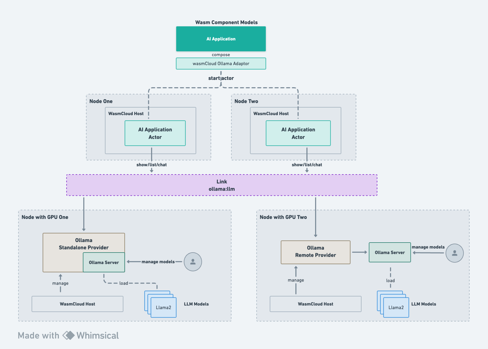
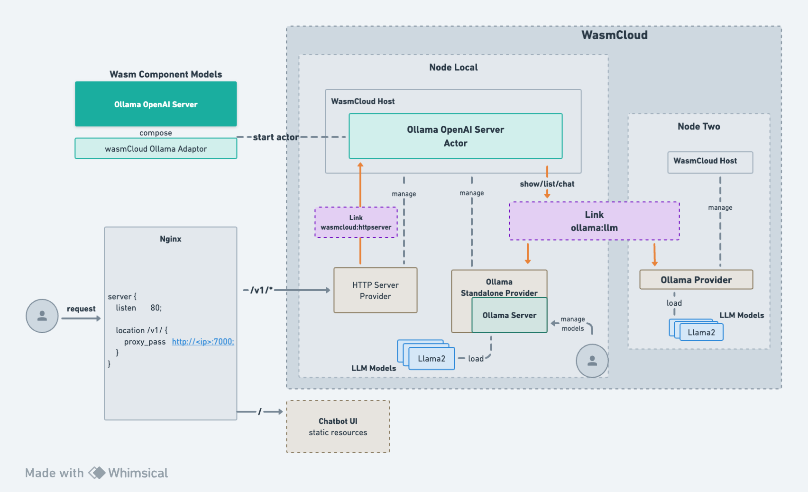

# [wasmCloud](https://github.com/wasmCloud/wasmCloud) & [Ollama](https://github.com/jmorganca/ollama)

**wasmCloud-Ollama enables Wasm AI applications to be distributedly deployed and to make distributed calls to underlying AI inference capabilities.**

The [Ollama](https://github.com/jmorganca/ollama)-based implementation allows Wasm AI to have [very rich model choices](https://ollama.ai/library) and
the flexibility to manage these models using native Ollama commands.



---

**wasmCloud-Ollama is one of wasmCloud's solutions for AI scenarios.**

**wasmCloud allows users to design and implement specific AI capabilities for Wasm AI applications through flexible interface definitions.**

Other AI capability interfaces and implementations:
* wasi-nn: https://github.com/Iceber/wasmcloud-wasi-nn

## What is wasmCloud
wasmCloud is a sandbox project of CNCF, which is mainly used for distributed deployment and management of Wasm, and breaks the function limitation of Wasm Runtime through the Actor-Provider way, allowing users to provide customized capabilities according to their business.

For more information about wasmCloud, please visit the [repository](https://github.com/wasmCloud/wasmCloud) and the [website](https://wasmcloud.com/).

## wasmCloud-Ollama
We use Ollama to complete a more complete and convenient model loading reasoning base capability, it has rich model loading capability.

wasmCloud-Ollama mainly provides the following components:
* [ollama.wit](./wit/ollama.wit): Ollama's Wasm interface definition, Wasm AI applications can *import* this wit to utilize the inference capabilities provided by the underlay.
* [wasmcloud_ollama_adaptor.wasm](./ollama-adaptor): enables Wasm AI applications using ollama.wit to run on wasmCloud.
* [wasmCloud Ollama Provider](./provider): implements the *ollama.wit* to provide inference capabilities to Wasm AI applications, and two implementations are provided:
    * **Remote Provider**: implements the ollama.wit interface by accessing a deployed Ollama Server, for a lighter binary.
    * **Standalone Provider**: runs the Ollama Server implementation at the same time, without the need to run an additional Ollama Server.

* [Ollama OpenAI Server](./examples/openai-server): Wasm application that implements OpenAI APIServer through *ollama.wit*.

## Quick - Running AI Large Language Models Locally
Let's take a quick look at the distributed AI inference capabilities of wasmCloud using *./examples/openai-server*.



### Deploying wasmCloud Locally
Download and install the wash command
```bash
# macos
$ brew install washmcloud/wasmcloud/wash
```
Other system installation commands: https://wasmcloud.com/docs/installation

Starting wasmCloud
```bash
$ wash up -d --nats-websocket-port 4001 --rpc-timeout-ms=20000
```

#### Run wasmCloud UI (optional)
In order to see the wasmCloud resources easily, you could run the ui service
```bash
$ wash ui
```

### Build and Deploy Ollam OpenAI Server
```
$ make openai-server
```
The Makefile encapsulates the building and composing of Ollama OpenAI Server. After executing the commands, you can directly see a Wasm component and Actor artifact.

```
$ ls -alh ./ollama_openai*
-rw-r--r--  1 icebergu  staff   4.5M  2  1 17:42 ./ollama_openai_server.wasm
-rw-r--r--  1 icebergu  staff   4.5M  2  1 17:42 ./ollama_openai_server_s.wasm
```
You can see that the compiled Wasm component is only 4.5M,
which is actually one of the advantages that Wasm brings to AI applications: it provides a lighter artifact while ensuring operational security.

Viewing information about the actor artifact.
```
$ wash claims inspect ./ollama_openai_server_s.wasm

                        ollama-openai-server - Actor
  Account         AB3OYLJCCEVR22KVJCJZBPZO74GLMXTERE2OEJAMUXSJWT4Y2QU6W5M5
  Actor           MBKTHG75VW5O7P4OHZMLV7YUQSDDZLNMPWIVQGSEPWFIUOQMZEGSJOOK
  Expires                                                            never
  Can Be Used                                                  immediately
  Version                                                        0.1.0 (1)
  Call Alias                                                     (Not set)
                                Capabilities
  HTTP Server
  Logging
  ollama:llm
                                    Tags
  None
```
You can see that the ollama-openai-server relies on three functions: **HTTP Server**, **Logging**, and **ollama:llm**, of which Logging will be provided by wasmCloud.

Now, in order to ensure that the server can run properly, you also need to deploy the **HTTP Server Provider** and the **ollama:llm Provider** to provide the corresponding capabilities.

Before deploying the providers, we can deploy the ollama-openai-server in wasmCloud first.
```bash
$ wash start actor file://`pwd`/ollama_openai_server_s.wasm

Actor [MBKTHG75VW5O7P4OHZMLV7YUQSDDZLNMPWIVQGSEPWFIUOQMZEGSJOOK] (ref: [file:///Users/icebergu/workspace/wasm/wasmcloud/ai/wasmcloud-ollama/ollama_openai_server_s.wasm]) started on host [ND4SFXMOROAHNRZV54KCEVU3HQC2BDGRVC3M5FCVSHYS2C3RSK35EIJD]
```

### Building and Deploying Ollama Provider
wasmCloud-ollama provides two ollama providers, to avoid deploying ollama server separately, we can deploy the ollama standalone-provider directly


Build ollama standalone provider
```
$ make standalone-provider-par

$ wash claims inspect ./standalone-provider.par


                  Ollama LLM Standalone Provider - Capability Provider
  Account                     AB3OYLJCCEVR22KVJCJZBPZO74GLMXTERE2OEJAMUXSJWT4Y2QU6W5M5
  Service                     VBHDATHFOKV4EUZK62XTQMTG4AZ7HYQDMY7RXQXIRMDMUGCVWV2LYRJM
  Capability Contract ID                                                    ollama:llm
  Vendor                                                                        Iceber
  Version                                                                         None
  Revision                                                                        None
                             Supported Architecture Targets
  aarch64-macos
```

Deploy standalone provider
```
$ echo "{ \"work_path\": \"`pwd`\" }" > config.json
$ wash start provider file://`pwd`/standalone-provider.par --config-json ./config.json

Provider [VBHDATHFOKV4EUZK62XTQMTG4AZ7HYQDMY7RXQXIRMDMUGCVWV2LYRJM] (ref: [file:///Users/icebergu/workspace/wasm/wasmcloud/ai/wasmcloud-ollama/standalone-provider.par]) started on host [ND4SFXMOROAHNRZV54KCEVU3HQC2BDGRVC3M5FCVSHYS2C3RSK35EIJD]
```
**Wasm AI application does not need to run on the same host as the ollama provider, the current example is in standalone mode, if there are multiple hosts, you can choose to deploy on any host**

#### Link to Ollama OpenAI Server
```
$ wash link put ollama-openai-server VBHDATHFOKV4EUZK62XTQMTG4AZ7HYQDMY7RXQXIRMDMUGCVWV2LYRJM ollama:llm
```

### Deploying HTTP Server Provider
```
$ wash start provider oci://wasmcloud.azurecr.io/httpserver:0.19.1

Provider [VAG3QITQQ2ODAOWB5TTQSDJ53XK3SHBEIFNK4AYJ5RKAX2UNSCAPHA5M] (ref: [oci://wasmcloud.azurecr.io/httpserver:0.19.1]) started on host [ND4SFXMOROAHNRZV54KCEVU3HQC2BDGRVC3M5FCVSHYS2C3RSK35EIJD]
```
**Note**: Even if you set a large default rpc timeout on wasmCloud startup, httpserver:0.19.1 still limits the timeout to 10s,
which has been fixed by https://github.com/wasmCloud/wasmCloud/pull/1439 , so you can build the [httpserver provider](https://github.com/Iceber/wasmCloud/tree/fix_rpc_client_timeout/crates/providers/http-server) yourself.

#### Link to  Ollama OpenAI Server

```
$ wash link put ollama-openai-server VAG3QITQQ2ODAOWB5TTQSDJ53XK3SHBEIFNK4AYJ5RKAX2UNSCAPHA5M wasmcloud:httpserver "address=0.0.0.0:7000"
```

#### Test connectivity
```
$ curl http://127.0.0.1:7000/echo
echo test

$ curl http://127.0.0.1:7000/v1/models
{"object":"list","data":[]}
```

### Selecting and downloading models
standalone-provider is compatible with Ollama commands, no need to download additional Ollama binaries.
```
$ ./build/standalone-provider --help
```

Select the appropriate model in the [Model Library](https://ollama.ai/library), or import a local model via the [Model File](https://github.com/ollama/ollama/blob/main/docs/modelfile.md).

Let's start with the most commonly used model, [Llama2](https://ollama.ai/library/llama2:latest).
```
$ ./build/standalone-provider pull llama2
```

### Accessing Ollama OpenAI Server with curl
```
$ curl http://127.0.0.1:7000/v1/models
{"object":"list","data":[{"id":"llama2:latest","created":1705651410,"object":"model","owned_by":"Not specified"},{"id":"llama2-chinese:latest","created":1707284593,"object":"model","owned_by":"Not specified"}]}

$ curl -X POST http://127.0.0.1:7000/v1/chat/completions -H 'accept:application/json' -H 'Content-Type: application/json' -d '{"model":"llama2","messages":[{"role":"system","content":"You are a helpful, respectful and honest assistant. Always answer as short as possible, while being safe."},{"role":"user","content":"hello"}],"temperature":1}'
{
  "id": "01b6ba99-4017-4249-98db-e363807e7aec",
  "object": "chat.completion",
  "created": 1707290034,
  "model": "llama2",
  "choices": [
    {
      "index": 0,
      "message": {
        "role": "assistant",
        "content": "Hello! How can I assist you today?"
      },
      "finish_reason": "stop"
    }
  ],
  "usage": {
    "prompt_tokens": 0,
    "completion_tokens": 0,
    "total_tokens": 0
  }
}
```

### Deploying Chat UI
Use [chatbot-ui](https://github.com/second-state/chatbot-ui) as ui, or you can choose any other ui.
```
$ curl -LO https://github.com/second-state/chatbot-ui/releases/download/v0.1.0/chatbot-ui.tar.gz && tar xvf chatbot-ui.tar.gz
```

Get the ip of the host running the HTTP Server Provider via `ifconfig` or other commands, and generate the nginx configuration.
```
$ HOST_IP=<YOUR IP ADDRESS>
$ echo """
server {
    listen       80;

    location /v1/ {
        proxy_pass   http://$HOST_IP:7000;
    }
}
""" > nginx.conf
```

Run nginx with docker
```
$ docker run --name chat-server -v `pwd`/chatbot-ui:/etc/nginx/html:ro -v `pwd`/nginx.conf:/etc/nginx/conf.d/default.conf:ro --rm -p 8080:80 nginx
```

Use a browser to access http://127.0.0.1:8080

## TODO
* Versioning the ollama wit and dependencies
* Optimizing field types
* Add more meaningful logs
* Push ollama-openai-server and ollama providers to the image repository
